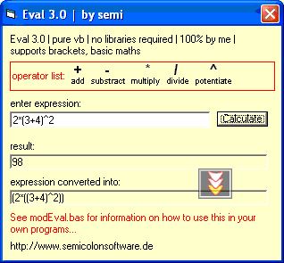



## evaluate a mathematical expression \| pure vb \| no extra libraries needed

### Description

This code evaluates any mathematical expression, e.g. 2*(3+4)^2 and returns its result.

Doesn't use any libraries and is provided in a .bas module.

Pls vote & post comments if you like it!

sorry for the screenshot quality, my pc broke and i had to use my old laptop which has nothing but vb on.
 
### More Info
 

             |
---                |---
**Submitted On**   |2002-12-11 11:54:04
**By**             |[semi](https://github.com/Planet-Source-Code/PSCIndex/blob/master/ByAuthor/semi.md)
**Level**          |Intermediate
**User Rating**    |5.0 (10 globes from 2 users)
**Compatibility**  |VB 4\.0 \(32\-bit\), VB 5\.0, VB 6\.0
**Category**       |[Math/ Dates](https://github.com/Planet-Source-Code/PSCIndex/blob/master/ByCategory/math-dates__1-37.md)
**World**          |[Visual Basic](https://github.com/Planet-Source-Code/PSCIndex/blob/master/ByWorld/visual-basic.md)
**Archive File**   |[evaluate\_a15116212112002\.zip](https://github.com/Planet-Source-Code/semi-evaluate-a-mathematical-expression-pure-vb-no-extra-libraries-needed__1-41500/archive/master.zip)

